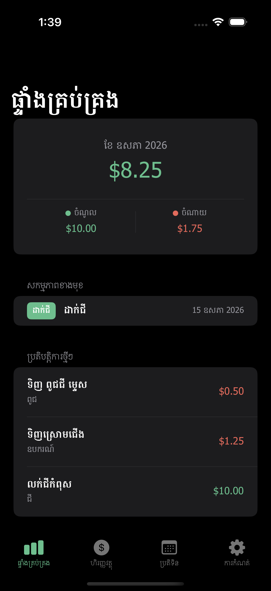
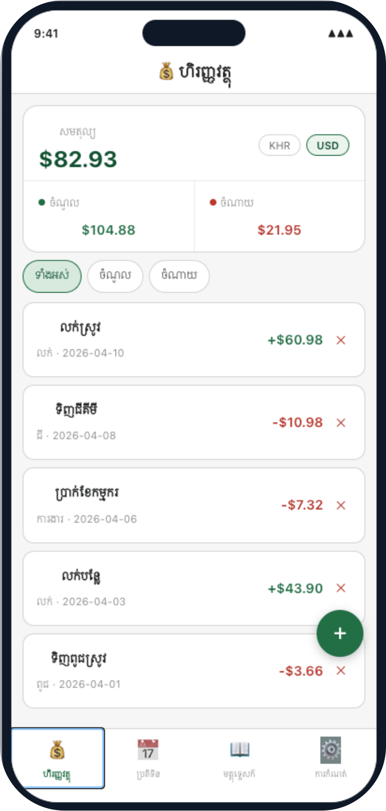
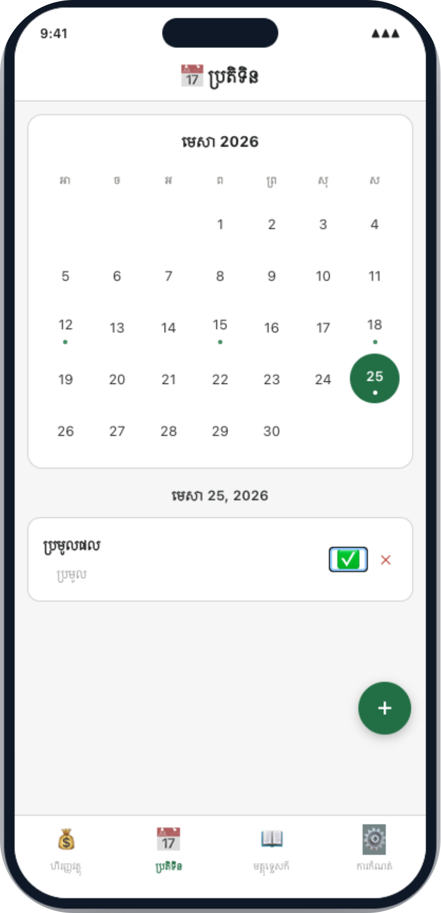
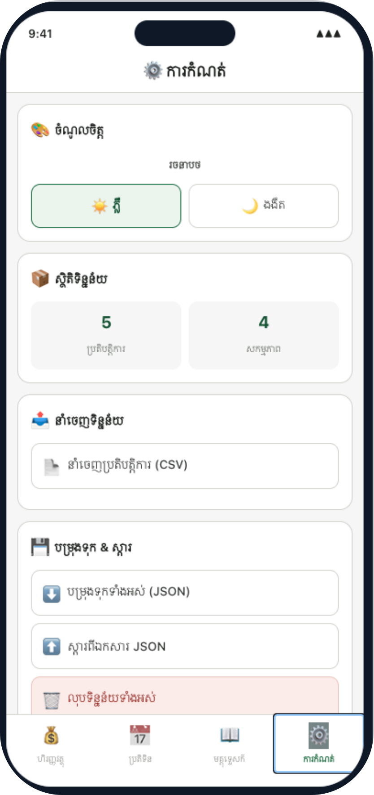

# SmartFarm — កសិកម្មឆ្លាតវៃ ងាយស្រួល

An offline-first farm-management demo designed for Cambodian small-scale farmers. SmartFarm bundles finance tracking, an activity calendar, and backup/restore tools into a single Khmer-language interface.

**Live demo:** https://nemsothea.github.io/smartfarmdemo/

**Pitch deck:** https://docs.google.com/presentation/d/1n3ROa-Cp5QTVe4Zn2yL60gpJ9mYfBeYU/edit?usp=sharing&ouid=103841083623835396121&rtpof=true&sd=true

---

## Screenshots

| Splash | Onboarding | Finance |
|:--:|:--:|:--:|
|  |  |  |

| Calendar | Settings |
|:--:|:--:|
|  |  |

---

## Features

- **ហិរញ្ញវត្ថុ — Finance tracker:** income/expense entries with category filters, KHR/USD toggle, and live balance/profit summaries.
- **ប្រតិទិន — Calendar & reminders:** monthly grid with activity markers, per-day task list, and completion toggles.
- **ការកំណត់ — Settings:** light/dark theme, data stats, CSV export, JSON backup & restore, and full data wipe.
- **Khmer-first UI** with Cambodian-friendly currency formatting.
- **Offline by design** — no network calls for core features.

---

## Tech stack

- React + Vite (web demo)
- Plain CSS, no UI framework
- Deployed to GitHub Pages via GitHub Actions

The product roadmap and module breakdown for the iOS/SwiftUI build live in [`READMEPLAN.md`](./READMEPLAN.md).

---

## Local development

```bash
npm install
npm run dev
```

Build for production:

```bash
npm run build
npm run preview
```

---

## Deployment (GitHub Pages)

This repo deploys `main` to GitHub Pages via GitHub Actions.

1. In GitHub: **Settings → Pages → Build and deployment → Source: GitHub Actions**
2. Push to `main` (or run the **Deploy to GitHub Pages** workflow manually)
